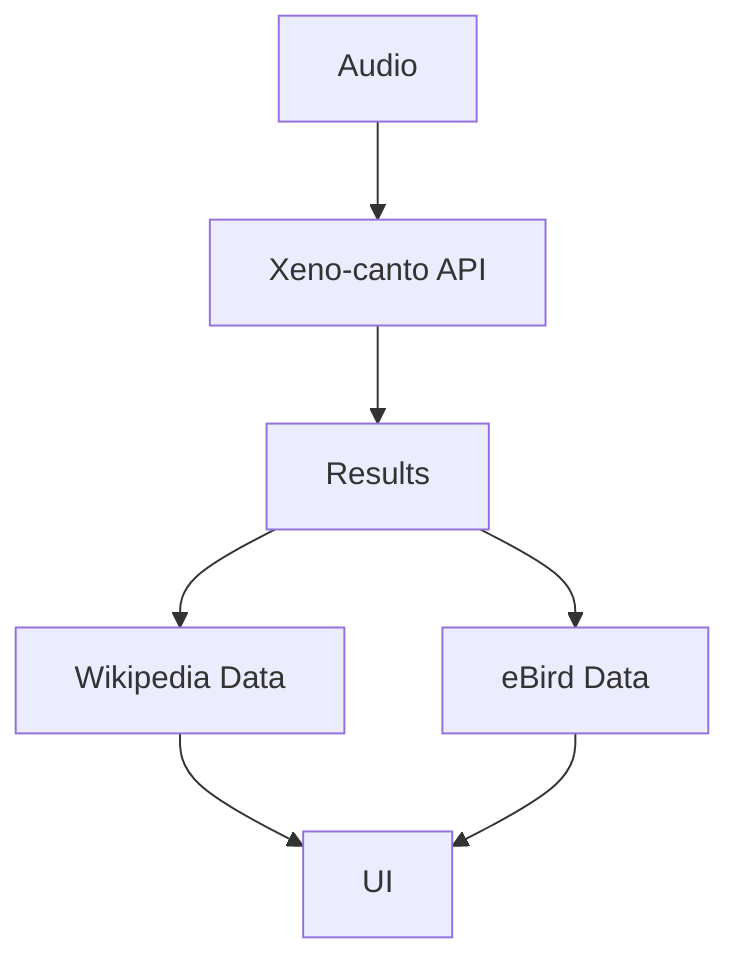

# 🦜 Bird Song Recognizer

#### [Video Demo:](https://youtu.be/XED2Mh3h3zE)

<a href="https://github.com/dwn10/CS50_FINAL_PROJECT/blob/main/project/img/CS50%20FINAL%20PROJECT.gif#"></a>

## 🎯 Description:

The Bird Song Recognizer is a web application developed in Python using the Streamlit framework. Its main objective is to allow users to identify bird species through their songs, either through live recordings or pre-recorded audio files. The system uses the Xeno-canto API to access an extensive database of bird recordings, complemented with detailed information from Wikipedia and taxonomic data from eBird.

The application stands out for its versatility in audio input, allowing live recordings of up to 60 seconds in WAV format at 44.1 kHz, as well as uploading files in .wav and .mp3 formats. Users can refine their searches using geographic filters covering 6 continents and more than 30 countries, in addition to quality filters (from "All" to "Verified") and sound types (Song, Call, Drumming).

For each identified species, the application provides:
- Detailed information integrated with Wikipedia, including images and descriptions
- Precise taxonomic classification based on eBird data
- Audio player to compare recordings
- Technical details of each recording, including date, location, and quality

The interface has been designed prioritizing ease of use and accessibility, allowing both professional ornithologists and amateurs to take full advantage of the system's capabilities.

### Project Objectives

1. **Accessibility**: Create an intuitive tool for ornithologists and amateurs.
2. **Accuracy**: Provide accurate results in species identification.
3. **Education**: Offer detailed information about each identified species.
4. **Efficiency**: Optimize the recording and matching process.

## 🏗 System Architecture

### Project Structure
```
Birds/
├── app.py              # Main application
├── requirements.txt    # Dependencies
└── README.md           # Detailed technical documentation
```

### Technologies Used

1. **Frontend**:
    - Streamlit (v1.31.1): Main framework for the user interface
    - HTML5/JavaScript: Custom components for geolocation
    - Custom CSS for visual enhancements

2. **Backend**:
    - Python 3.11+: Main development language
    - PyAudio: Audio recording management
    - Wave: WAV file processing
    - NumPy: Numerical processing and signal analysis
    - Requests: Communication with external APIs

3. **External APIs and Services**:
    - Xeno-canto API: Bird song database
    - OpenStreetMap Nominatim: Reverse geocoding
    - Wikipedia API: Species information
    - eBird API: Taxonomic data

## 🔧 Main Components

### 1. Audio Recording System

The audio recording component has been optimized to provide the best possible quality while maintaining efficient performance:

```python
# Optimized recording configuration
CHUNK_SIZE = 8192  # Optimized buffer size
FORMAT = pyaudio.paFloat32
CHANNELS = 1
RATE = 44100
```

#### Implemented Optimizations:
- Buffer increased to 8192 bytes to reduce I/O overhead
- Use of pre-allocated frames for better memory management
- Recording progress updated every 10% to reduce UI load

### 2. Geolocation System

Implementation of a custom HTML5 component to obtain user location:

- Uses the browser's Geolocation API
- Integration with OpenStreetMap for reverse geocoding
- Automatic fallback to manual selection
- Coordinate cache to reduce requests

### 3. Search Engine

The search system is designed to provide accurate and relevant results:

1. **Preprocessing**:
    - Normalization of search parameters
    - Validation of filters and criteria
    - Construction of optimized queries

2. **Filters**:
    - Geographic (continent, country)
    - Recording quality (A, B, C)
    - Sound type (song, call, drumming)

3. **Results Processing**:
    - Sorting by relevance
    - Grouping by species
    - Enrichment with additional data

## 📊 Data Flow

### 1. Audio Recording


### 2. Search Process


## 🔌 Interfaces and APIs

### 1. Xeno-canto API
- Endpoint: `https://xeno-canto.org/api/2/recordings`
- Method: GET
- Main parameters:
  - `query`: Search terms
  - `page`: Pagination
  - `cnt`: Country
  - `type`: Sound type

### 2. OpenStreetMap Nominatim
- Endpoint: `https://nominatim.openstreetmap.org/reverse`
- Usage limit: 1 request per second
- Custom headers for identification

### 3. Wikipedia API
- Multiple endpoints for metadata and content
- Cache implemented to reduce requests
- Handling of redirects and disambiguation

## ⚡ Optimizations and Improvements

### 1. Performance
- Cache implementation for frequent data
- Lazy loading of heavy components
- Optimization of external API queries

### 2. UX/UI
- Immediate visual feedback
- Progress indicators
- Friendly error handling
- Responsive adaptation

### 3. Code
- Component modularization
- Comprehensive documentation
- Unit tests
- Version control

## 🔍 Technical Considerations

### 1. Security
- User input validation
- Rate limiting on API calls
- Data sanitization
- Secure handling of temporary files

### 2. Scalability
- Modular architecture
- Distributed cache
- Resource optimization

### 3. Maintainability
- Documented code
- Detailed logs
- Semantic versioning

## 🛠 Maintenance Guide

### 1. Updates
- Review dependencies monthly
- Update APIs when necessary
- Keep documentation up to date

### 2. Monitoring
- Error logs
- Usage metrics
- System performance

### 3. Backups
- Configuration
- User data
- System cache

## 🔄 Development Cycle

### 1. Testing
- Unit tests with pytest
- Integration tests
- UI/UX tests

### 2. Deployment
- Dependency verification
- Regression tests
- Documentation update

### 3. Maintenance
- Error monitoring
- Periodic optimizations
- Security updates

## 📈 Metrics and KPIs

### 1. Performance
- Response time < 2s
- Memory usage < 500MB
- CPU < 50%

### 2. Usability
- Identification success rate > 80%
- User satisfaction > 4.5/5
- Average session time

### 3. Technical
- Code coverage > 90%
- Build time < 5min
- Availability > 99.9%

## 🔜 Technical Roadmap

### Upcoming Improvements
1. Machine learning implementation for pre-processing
2. Integration with more bird databases
3. Distributed cache system
4. Public API for developers
5. Support for more audio formats

### Future Optimizations
1. Memory usage reduction
2. Improvement in search accuracy
3. PWA implementation
4. Offline support
5. Real-time analysis

## 🔐 Secret and Configuration Management

### Production Configuration

The application supports two main methods for managing secrets and configurations, optimized for different deployment environments:

#### 1. Streamlit Secrets (.secrets)
Recommended for deployments on Streamlit Cloud:
- Native integration with the platform
- Automatic secret encryption
- Simplified management through the dashboard

```python
# Example of use in code
import streamlit as st

XENO_CANTO_API_KEY = st.secrets["api_keys"]["xeno_canto"]
EBIRD_API_KEY = st.secrets["api_keys"]["ebird"]
```

#### 2. Environment Variables (.env)
Recommended for local deployments or on self-hosted servers:
- Compatible with multiple deployment platforms
- Industry standard
- Ideal for Docker and other cloud services

```python
# Example usage in code
from dotenv import load_dotenv
import os

load_dotenv()
XENO_CANTO_API_KEY = os.getenv('XENO_CANTO_API_KEY')
EBIRD_API_KEY = os.getenv('EBIRD_API_KEY')
```

### Configuration File Structure

```plaintext
Birds/
├── .gitignore         # Includes .env and .streamlit/secrets.toml
├── .env               # For local development
└── .streamlit/
  ├── config.toml      # UI configuration
  └── secrets.toml     # Secrets for Streamlit Cloud
```

### Required Configuration Variables

The following variables must be configured in the corresponding environment:

| Variable | Description | Required |
|----------|-------------|-----------|
| XENO_CANTO_API_KEY | API key for Xeno-canto | Yes |
| EBIRD_API_KEY | API key for eBird | Yes |
| WIKIPEDIA_USER_AGENT | User agent for Wikipedia API | Yes |
| DEBUG_MODE | Debug mode (true/false) | No |

## 🤝 Contributing

Contributions are welcome. Please:

1. Fork the repository
2. Create a branch for your feature
3. Make your changes
4. Submit a pull request

## 📄 License and Open Source

This project is **open source** and is under the MIT License, one of the most popular licenses in the free software world. This means that:

### ✅ You have the freedom to:
- Use the code for commercial projects
- Modify the source code
- Distribute the software
- Use privately
- Sublicense

### 📋 Under the following conditions:
- Maintain the copyright notice and license in all copies
- The software is provided "as is", without warranties
- Authors are not liable for damages arising from use

### 🤝 Open Source Philosophy
This project embraces the philosophy of free and open-source software (FOSS):
- Full transparency in development
- Community collaboration welcomed
- Public and accessible source code
- Community-driven development

### 💡 How to Contribute
1. Fork the repository
2. Create a branch for your feature
3. Develop and test your changes
4. Submit a pull request
5. Join our community!

For more details about the license, see the [`LICENSE`](LICENSE) file.

### 📚 Cite this Project
If you use this software in your research or project, please cite it as:

```bibtex
@software{bird_song_recognizer,
  author = {[Your Name]},
  title  = {Bird Song Recognizer},
  year   = {2025},
  url    = {[Repository URL]},
  note   = {Open Source under MIT License}
}
```

## 🙏 Acknowledgements

- [Xeno-canto](https://xeno-canto.org/) for their bird song API
- [OpenStreetMap](https://www.openstreetmap.org/) for the geocoding service
- [eBird](https://ebird.org/) for the taxonomic data
- [Wikipedia](https://www.wikipedia.org/) for species information
- [Gemini](https://gemini.google.com/) Technical support and translation tool

## Credits:

**HarvardX CS50x - 2025**
```bash
  David J. Malan
  malan@harvard.edu
```

**Participant:**

```bash
  Darwin Paz
```
