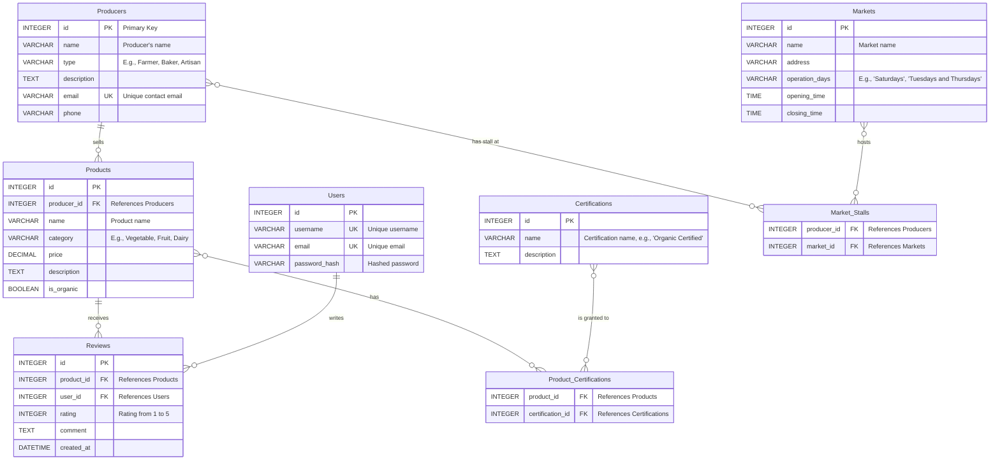

# CS50 SQL - FINAL PROJECT

## Database Design: Local Markets and Producers Directory

- **Author**: Darwin Paz
- **Usernames**: GitHub: dwn10, EdX: DP_2501_BYJ6
- **City and Country**: Darmstadt - Germany
- **Date**: 20 August 2025

#### [Video Demo:](#)

<a href="#"></a>

## 🎯 Purpose
The purpose of this project is to create a robust and scalable database called "MercadoLocalDB". This database will serve as the backend for a web and mobile application designed to connect consumers with local food producers and farmers' markets. In a world where people increasingly value fresh, sustainable, and locally-sourced products, this platform aims to solve the problem of decentralized information. Users will be able to easily discover which producers are in their area, what products they offer, which markets they can be found at, and what other consumers think. The ultimate goal is to boost the local economy, promote healthier and more sustainable consumption habits, and strengthen the bond between the community and its food producers.

## 📈 Scope
The database will focus on managing key information about producers, products, markets, and user interactions with them. The application will allow users to perform the following actions:

1. **Search and filter**:
   - Users will be able to search for producers by name or type (e.g., "farmer", "baker"), products by category (e.g., "vegetables", "dairy"), and markets by location or operating day.

2. **View detailed profiles**:
   - Each producer and market will have a profile page with their description, contact information, products they offer, and business hours.

3. **Discover products**:
   - Users will be able to browse product catalogs, view prices, and see details such as whether a product is organic or seasonal.

4. **Leave reviews and ratings**:
   - Registered users will be able to rate and write reviews about products and producers to help other community members.

5. **Find points of sale**:
   - The key functionality will be connecting products and producers with the markets where they can be purchased, clearly showing "where to buy what".

The initial version of the project will not include e-commerce features (such as shopping carts or payment gateways), real-time inventory management for producers, or subscription/delivery systems. These features are considered potential future expansions.

## Entity-Relationship Diagram (ERD)
- Below is the ERD that visualizes the database structure, including the main entities and their relationships.



## 📋 Detailed Schema Description

### Entities / Relationships / Database Structure

### 1. Producers
Stores information about each seller. A producer can have many Products.

| Column | Type | Description |
|--------|------|-------------|
| id | INTEGER | Primary key |
| name | VARCHAR(100) | Producer's name |
| type | VARCHAR(50) | Type (e.g., 'Farmer', 'Baker') |
| description | TEXT | Business description |
| email | VARCHAR(100) | Contact email |
| phone | VARCHAR(20) | Contact phone |
| created_at | TIMESTAMP | Creation date |
| updated_at | TIMESTAMP | Last update |

### 2. Markets
Stores information about physical market locations.

| Column | Type | Description |
|--------|------|-------------|
| id | INTEGER | Primary key |
| name | VARCHAR(100) | Market name |
| address | TEXT | Full address |
| operation_days | VARCHAR(100) | Operating days |
| opening_time | TIME | Opening time |
| closing_time | TIME | Closing time |
| created_at | TIMESTAMP | Creation date |
| updated_at | TIMESTAMP | Last update |

### 3. Products
Contains the details of each item for sale. Each product belongs to a single Producer.

| Column | Type | Description |
|--------|------|-------------|
| id | INTEGER | Primary key |
| producer_id | INTEGER | Foreign key to Producers |
| name | VARCHAR(100) | Product name |
| category | VARCHAR(50) | Category (e.g., 'Vegetable', 'Dairy') |
| price | DECIMAL(10,2) | Unit price |
| description | TEXT | Product description |
| is_organic | BOOLEAN | Is organic? |
| is_seasonal | BOOLEAN | Is seasonal? |
| created_at | TIMESTAMP | Creation date |
| updated_at | TIMESTAMP | Last update |

### 4. Users
Stores data for registered users who can write reviews.

| Column | Type | Description |
|--------|------|-------------|
| id | INTEGER | Primary key |
| username | VARCHAR(50) | Unique username |
| email | VARCHAR(100) | Unique email |
| password_hash | VARCHAR(255) | Hashed password |
| first_name | VARCHAR(50) | First name |
| last_name | VARCHAR(50) | Last name |
| created_at | TIMESTAMP | Creation date |
| updated_at | TIMESTAMP | Last update |

### 5. Certifications
A catalog of possible certifications (e.g., "Organic", "Fair Trade").

| Column | Type | Description |
|--------|------|-------------|
| id | INTEGER | Primary key |
| name | VARCHAR(100) | Certification name |
| description | TEXT | Description |
| created_at | TIMESTAMP | Creation date |

## Relationship Tables

### 6. Market_Stalls
A junction table that resolves the many-to-many relationship between Producers and Markets. A producer can sell at multiple markets, and a market can host many producers.

| Column | Type | Description |
|--------|------|-------------|
| producer_id | INTEGER | Foreign key to Producers |
| market_id | INTEGER | Foreign key to Markets |
| stall_number | VARCHAR(20) | Stall number |
| created_at | TIMESTAMP | Creation date |

### 7. Product_Certifications
Junction table that manages the many-to-many relationship between Products and Certifications. A product can have multiple certifications.

| Column | Type | Description |
|--------|------|-------------|
| product_id | INTEGER | Foreign key to Products |
| certification_id | INTEGER | Foreign key to Certifications |
| certified_at | DATE | Certification date |
| expires_at | DATE | Expiration date |
| created_at | TIMESTAMP | Creation date |

### 8. Reviews
Stores the ratings and comments that Users make about Products. Each review is linked to a product and a user.

| Column | Type | Description |
|--------|------|-------------|
| id | INTEGER | Primary key |
| product_id | INTEGER | Foreign key to Products |
| user_id | INTEGER | Foreign key to Users |
| rating | INTEGER | Rating (1-5) |
| comment | TEXT | Review comment |
| created_at | TIMESTAMP | Creation date |

## Optimizations

- To ensure the database remains fast and efficient, especially as it grows, the following optimizations have been implemented:

### Indexing
- Indexes (INDEX) have been created on all foreign keys (e.g., `products.producer_id`, `reviews.product_id`). This dramatically speeds up JOIN operations that will be very common, such as when searching for all products from a producer.

### Search Column Indexes
- Indexes have been added to columns that will be frequently used for searches and filters, such as `producers.name`, `products.name`, and `products.category`. This will prevent full table scans and improve the user experience.

### Views
- A view called `complete_market_view` has been created. This view pre-calculates the union of Producers, Products, and Markets. Instead of performing this complex JOIN every time, the application can query this view directly to get a complete list of which products are available at each market, simplifying frontend queries and improving performance.

### Appropriate Data Types
- The data type for each column has been carefully chosen to optimize storage. For example, using BOOLEAN for `is_organic` is much more efficient than VARCHAR. Prices are stored as DECIMAL to avoid precision issues with floating-point numbers.

## Limitations

- Although the design is robust, it's essential to acknowledge its limitations:

### Real-time Inventory Management
- The database does not handle real-time inventory. While producers can list their products, there is no automated stock tracking. This means a product might appear as available even if it's out of stock at a specific market.

### Basic Geolocation
- Although the database stores market addresses, it does not include advanced geolocation features such as radius search or route calculation. This could be implemented in the future by integrating with APIs like Google Maps.

### Review System Scalability
- The review system is basic and lacks advanced features like helpfulness voting, reporting of inappropriate reviews, or moderation. As the user base grows, these features might become necessary.

### Basic Security
- While passwords are stored with hashing, the overall security of the application will depend on the backend implementation. Additional measures like two-factor authentication are recommended, especially for producer accounts.

### Performance at Scale
- Although optimizations have been implemented, performance with large data volumes (thousands of producers and millions of reviews) might require additional adjustments, such as table partitioning or application-level caching.

## Example SQL Queries

```sql
-- ==============================================================
-- 1. FIND ALL ORGANIC PRODUCTS WITH THEIR PRODUCERS AND MARKETS
-- ==============================================================
-- This query helps consumers find organic products and where to buy them

SELECT
    p.name AS product_name,
    p.category,
    p.price,
    pr.name AS producer_name,
    m.name AS market_name,
    m.address,
    m.operation_days,
    m.opening_time || ' - ' || m.closing_time AS market_hours
FROM
    Products p
JOIN
    Producers pr ON p.producer_id = pr.id
JOIN
    Market_Stalls ms ON pr.id = ms.producer_id
JOIN
    Markets m ON ms.market_id = m.id
WHERE
    p.is_organic = 1
ORDER BY
    p.category, p.name;
```

```sql
-- ==============================================================
-- 2. INSERT A NEW PRODUCT
-- ==============================================================
-- This would be used when a producer adds a new product

INSERT INTO Products (
    producer_id,
    name,
    category,
    price,
    description,
    is_organic,
    is_seasonal
) VALUES (
    1,  -- Parameterize in application
    'Organic Heirloom Tomatoes',
    'Vegetable',
    4.99,
    'Delicious heirloom tomatoes grown with organic methods',
    1,  -- TRUE for organic
    1   -- TRUE for seasonal
);
```

```sql
-- ==============================================================
-- 3. FIND PRODUCTS WITH THE HIGHEST PRICE INCREASE OVER TIME
-- ==============================================================
-- This could help identify products that might be priced too high

SELECT
    p.id,
    p.name,
    p.category,
    p.price AS current_price,
    ph.price AS previous_price,
    ROUND(((p.price - ph.price) / ph.price) * 100, 2) AS price_increase_percent,
    ph.recorded_at AS price_change_date
FROM
    Products p
JOIN
    Product_History ph ON p.id = ph.product_id
WHERE
    ph.recorded_at = (
        SELECT MAX(recorded_at)
        FROM Product_History
        WHERE product_id = p.id AND recorded_at < DATE('now', '-7 days')
    )
    AND p.price > ph.price * 1.1  -- Price increased by more than 10%
ORDER BY
    price_increase_percent DESC
LIMIT 10;
```

## 🙏 Acknowledgements

- [SQLite](https://sqlite.org/index.html) relational database management system
- [Mermaid](https://mermaid.js.org/) tool for graphing diagrams
- [Markmap](https://markmap.js.org/) mind map viewer

## 🤝 Credits:

**Harvard CS50 / SQL - 2025**
```bash
  David J. Malan
  malan@harvard.edu
```

**Participant:**

```bash
  Darwin Paz
```