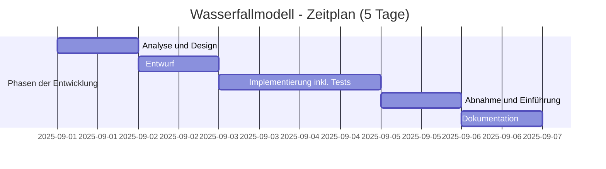

# ARTEQ WEB

Professionelle Website für ARTEQ, die umfassende Dienstleistungen für Räumungen, Umzüge, Transport und Reinigung in Hessen, Rheinland-Pfalz und Baden-Württemberg anbietet.
---

### Services von ARTEQ
- **Räumungsservice**
  - Haushaltsauflösungen
  - Entrümpelungen
  - Schädlingsbekämpfung

- **Umzugsservice**
  - Privat- und Geschäftsumzüge
  - Möbeltransport
  - Umzugsplanung

- **Reinigungsdienstleistungen**
  - Grundreinigung
  - Unterhaltsreinigung
  - Spezielle Reinigungen

- **Zusätzliche Services**
  - Hausmeisterservice
  - Entsorgungsservice
  - Winterdienst
  
## Verwendete Technologien:

```javascript
const Project = {
  code: ["HTML", "CSS", "JS"],
  technologies: {
    frontend: ["HTML5"],
    devTool: ["VS-Code"],
  },
};
```

## 🎨 Design-Spezifikationen

- **Hauptfarben:**
    - **Primär:** `#2563eb` (kräftiges Blau)
    - **Sekundär:** `#f59e0b` (warmes Orange)
    - **Akzentfarben:** `#1f2937` (Dunkelgrau für Text), `#f3f4f6` (Hellgrau für Hintergründe), `#ffffff` (Weiß)
- **Typografie:**
    - **Schriftfamilie:** `-apple-system, BlinkMacSystemFont, 'Segoe UI', Roboto, Oxygen, Ubuntu, Cantarell, sans-serif`
    - **Einsatz:** Serifenlose Schriftarten für klare Lesbarkeit auf allen Geräten.
---

## 📁 Projektstruktur

```
ARTEQ/
│
├── assets/                    # Statische Dateien
│   ├── css/                   # Stylesheets  (ca. 1620 Zeilen)
│   │   ├── style.css          # Haupt-Stylesheet
│   │   └── responsive.css     # Stile für Mobilgeräte
│   ├── js/                    # JavaScript-Dateien (ca. 575 Zeilen)
│   │   ├── main.js            # Haupt-JavaScript
│   │   └── cookies.js         # Cookie-Verwaltung
│   └── images/                # Bilder und Icons
│       ├── logo.ico           # Website-Logo
│       ├── favicon.ico        # Browser-Tab-Icon
│       └── ArteQ.png          # Bild Über uns
│
├── pages/                     # Weitere HTML-Seiten  (ca. 560 Zeilen)
│   ├── kontakt.html           # Kontaktseite
│   ├── Impressum.html         # Impressum
│   ├── datenschutz.html       # Datenschutzerklärung
│   ├── terms.html             # Allgemeine Geschäftsbedingungen
│   └── cookies.html           # Cookie-Richtlinie
│
├── index.html                 # Startseite (ca. 558 Zeilen)
└── README.md                  # Projektbeschreibung
```

## ⚙️ Technische Implementierung

- **Frontend**
- Moderne, Webseite mit HTML5, CSS3 und JavaScript
- Optimiert für Suchmaschinen (SEO)
- Barrierefreies Design gemäß WCAG-Richtlinien
- Kontaktformular mit Client-seitiger Validierung
- Dynamische Inhalte mit JavaScript
- Responsive Design für alle Geräte
- Optimierte Ladezeiten

- **SEO-Optimierung**
  - Meta-Tags und strukturierte Daten
  - Optimierte Ladezeiten
  - Mobile-First-Ansatz
  - Klare URL-Struktur

## Technische Anforderungen

- Moderne Browser (Chrome, Firefox, Safari, Edge)
- Aktiviertes JavaScript für volle Funktionalität
- Internetverbindung für externe Ressourcen

## Technologien

- **Frontend**
  - HTML5
  - CSS3 (mit CSS-Variablen)
  - JavaScript (Vanilla)
  - Font Awesome für Icons
  - Google Fonts für Typografie

- **Tools & Workflow**
  - Git für Versionskontrolle
  - Responsive Design
  - Barrierefreiheit (WCAG 2.1)
  - SEO-Best Practices

## Cookie-Implementierung

### Übersicht
Diese Webseite verwendet Cookies, um die Benutzererfahrung zu verbessern und die Funktionalität der Seite zu gewährleisten. Durch die Nutzung unserer Webseite stimmen Sie der Verwendung von Cookies gemäß unserer Datenschutzerklärung zu.

### Verwendete Cookie-Typen

#### 1. Notwendige Cookies
- **Zweck**: Essenziell für die Grundfunktionen der Webseite
- **Beispiele**:
  - Session-Cookies für die Aufrechterhaltung der Benutzersitzung
  - Sicherheits-Cookies zum Schutz vor Cross-Site-Request-Forgery (CSRF)
- **Speicherdauer**: Sitzungsdauer oder gemäß gesetzlicher Vorgaben

#### 2. Präferenz-Cookies
- **Zweck**: Speichern von Benutzereinstellungen und Präferenzen
- **Beispiele**:
  - Spracheinstellungen
  - Schriftgrößen-Präferenzen
  - Dunkelmodus-Einstellungen
- **Speicherdauer**: Bis zur Löschung durch den Benutzer oder gemäß Browsereinstellungen

#### 3. Statistik-Cookies
- **Zweck**: Analyse der Webseitennutzung zur Verbesserung des Angebots
- **Erfasste Daten**:
  - Besuchte Seiten
  - Verweildauer
  - Klickverhalten
- **Tools**: Google Analytics (falls implementiert)
- **Speicherdauer**: Maximal 14 Monate

### Cookie-Consent-Banner

#### Funktionalität
- Wird beim ersten Besuch der Webseite eingeblendet
- Ermöglicht die individuelle Anpassung der Cookie-Einstellungen
- Speichert die getroffenen Auswahlpräferenzen

#### Technische Umsetzung

## 🍪 Cookie-Verwaltung

Die Implementierung des Cookie-Banners umfasst:

- **Schaltfläche 'Alle akzeptieren'**: Akzeptiert alle Cookies (notwendige, analytische und Marketing-Cookies)
- **Schaltfläche 'Einstellungen'**: Ermöglicht die Anpassung der Cookie-Einstellungen
- **Schaltfläche 'Ablehnen'**: Lehnt alle Cookies mit Ausnahme der technisch notwendigen ab

### Implementierte Funktionen:

1. **Speicherung der Einstellungen**: Benutzereinstellungen werden in Cookies mit einer Gültigkeit von 1 Jahr gespeichert
2. **Selektives Laden**: Drittanbieter-Skripte werden nur gemäß den Benutzereinstellungen geladen
3. **Beständigkeit**: Die Einstellungen bleiben über Sitzungen hinweg erhalten
4. **Barrierefreiheit**: Die Steuerelemente sind tastaturbedienbar und mit Bildschirmlesegeräten kompatibel

### Implementierungsbeispiel:

```javascript
// Beispiel für die Implementierung der 'Ablehnen'-Schaltfläche
document.getElementById('reject-cookies').addEventListener('click', function() {
    setCookie('cookie_consent', 'necessary', 365);
    setCookie('necessary_cookies', 'true', 365);
    setCookie('analytics_cookies', 'false', 365);
    setCookie('marketing_cookies', 'false', 365);
    cookieBanner.style.display = 'none';
    loadCookies();
});
```

### Speicherung der Cookie-Einstellungen

#### Bei Klick auf "Alle akzeptieren" werden folgende Cookies im Browser des Benutzers gespeichert:

| Cookie-Name | Wert | Gültigkeit | Zweck |
|-------------|------|------------|-------|
| `cookie_consent` | `all` | 365 Tage | Zeigt an, dass der Benutzer allen Cookie-Typen zugestimmt hat |
| `necessary_cookies` | `true` | 365 Tage | Aktiviert technisch notwendige Cookies |
| `analytics_cookies` | `true` | 365 Tage | Aktiviert Analyse-Cookies |
| `marketing_cookies` | `true` | 365 Tage | Aktiviert Marketing-Cookies |

#### Speicherort:
- Die Cookies werden im Browser des Benutzers gespeichert
- Sie sind nur für die eigene Domain sichtbar
- Können in den Browsereinstellungen eingesehen und verwaltet werden

#### Sicherheit:
- Keine Speicherung personenbezogener Daten in den Cookies
- Cookies sind nur über HTTPS verfügbar (wenn die Website mit SSL gesichert ist)
- Gültigkeitsdauer: 1 Jahr nach der Zustimmung

#### Überprüfung der Cookies:
Benutzer können die gespeicherten Cookies über die Entwicklertools des Browsers (F12) unter folgendem Pfad einsehen:
- Chrome/Edge: Application > Cookies > [Ihre-Domain]
- Firefox: Speicher > Cookies > [Ihre-Domain]
- Safari: Speicher > Cookies

```javascript
    // Überprüfen, ob bereits eine Auswahl getroffen wurde
    if (!getCookie('cookie_consent')) {
        cookieConsent.style.display = 'block';
    }
    
    // Event-Listener für Buttons
    acceptAllBtn?.addEventListener('click', function() {
        setCookie('cookie_consent', 'all', 365);
        cookieConsent.style.display = 'none';
        // Alle Cookies aktivieren
    });
    
    savePrefsBtn?.addEventListener('click', function() {
        // Speichere individuelle Einstellungen
        // ...
        setCookie('cookie_consent', 'custom', 365);
        cookieConsent.style.display = 'none';
    });
```

### Rechtliche Anforderungen
- **DSGVO-Konformität**:
  - Informationspflicht über Cookie-Nutzung
  - Einwilligung vor dem Setzen nicht-notwendiger Cookies
  - Widerspruchsrecht für Nutzer
- **TTDSG (Deutschland)**:
  - Strikte Einwilligungspflicht für Tracking-Cookies
  - Klare Information über die Drittanbieter

### Verantwortung
- **Verantwortliche Stelle**: ARTEQ
- Kontaktmöglichkeiten: Siehe Impressum
- Datenschutzbeauftragter: Bei Bedarf über die Kontaktdaten im Impressum

### Weitere Informationen
- Detaillierte Informationen finden Sie in unserer [Datenschutzerklärung](#)
- Cookie-Einstellungen können jederzeit über den Link im Footer der Webseite angepasst werden

## Barrierefreiheit

Die Webseite enthält folgende Barrierefreiheitsfunktionen:

- Kontrastreiches Design
- Semantische HTML5-Struktur
- Tastaturnavigation
- Verbesserter Farbkontrast
- ARIA-Attribute für bessere Screenreader-Kompatibilität
- Sprachausgabe für bessere Barrierefreiheit
- Anpassbare Schriftgrößen
- Klare Struktur und Überschriften

## Browser-Kompatibilität

- Getestet mit modernen Browsern (Chrome, Firefox, Safari, Edge)
- Vollständige Mobilgeräte-Unterstützung
- Responsive Design für alle Bildschirmgrößen

## Sprachen

Die Webseite unterstützt folgende Sprachen:
- Deutsch   (Standard)
- Spanisch  (Opt.)
- Englisch  (Opt.)

## Sicherheit

### Aktuelle Maßnahmen

- **Client-seitige Validierung** aller Formulareingaben
- **XSS-Schutz** durch automatische Bereinigung von Benutzereingaben
- **HTTPS-Verschlüsselung** für alle übertragenen Daten
- **Regelmäßige Sicherheitsaudits** der Webanwendung

## 📧 E-Mail-Obfuskation

Zum Schutz vor Spam-Bots wurde eine JavaScript-basierte E-Mail-Verschleierung implementiert:

### Funktionsweise:
- Die E-Mail-Adresse wird im Quellcode verschlüsselt dargestellt
- Beim Klick auf den Link wird die verschlüsselte Version in der Browser-Statuszeile angezeigt
- Die eigentliche E-Mail-Adresse wird erst beim Klick entschlüsselt

### Technische Umsetzung:
```javascript
// email-obfuscator.js
function linkTo_UnCryptMailto(s) {
    window.status = 'javascript:linkTo_UnCryptMailto(\'jotujp`bsdspnqfrnbns\')';
    setTimeout(function() {
        let email = 'info@arte-q.com';
        window.location.href = 'mailto:' + email;
        window.status = '';
    }, 100);
    return false;
}
```

### HTML-Implementierung:
```html
<a href="javascript:linkTo_UnCryptMailto('jotujp`bsdspnqfrnbns')">
    info(at)arte-q(dot)com
</a>
```

### Vorteile:
- Schutz vor automatisierten E-Mail-Harvestern
- Gute Benutzerfreundlichkeit (klickbarer Link)
- Keine Abhängigkeit von externen Bibliotheken

## Nächste Schritte

### 🚀 Zukünftige Verbesserungen

## 🔒 Sicherheit

1. **Sicherheitserweiterungen**
   - Implementierung von hCaptcha für das Kontaktformular
   - Erweiterte Formularvalidierung
   - SSL-Verschlüsselung

2. **Erweiterte Funktionen**
   - Online-Terminvereinbarung
   - Live-Chat-Support
   - Kundenportal für Auftragsverfolgung

3. **Leistung & Optimierung**
   - Lazy Loading für Bilder (Optional)
   - Caching-Strategien
   - Performance-Monitoring

#### 1. Schutz vor Bots & Spam
- [ ] **hCaptcha Integration**
  ```html
  <div class="h-captcha" data-sitekey="IHR_SITE_SCHLÜSSEL"></div>
  <script src="https://js.hcaptcha.com/1/api.js" async defer></script>
  ```

- [ ] **Honeypot-Feld**
  ```html
  <div style="position: absolute; left: -5000px;" aria-hidden="true">
      <input type="text" name="website" tabindex="-1">
  </div>
  ```

- [ ] **Rate Limiting** (5 Anfragen/15 Minuten pro IP)

#### 2. Serverseitige Sicherheit
- [ ] **CSRF-Schutz**
  ```javascript
  // Express.js Beispiel
  const csrf = require('csurf');
  const csrfProtection = csrf({ cookie: true });
  app.use(csrfProtection);
  ```

- [ ] **Eingabevalidierung**
  ```javascript
  const { body, validationResult } = require('express-validator');
  
  app.post('/kontakt', [
    body('email').isEmail().normalizeEmail(),
    body('name').trim().isLength({ min: 2 })
  ], (req, res) => {
    const errors = validationResult(req);
    if (!errors.isEmpty()) {
      return res.status(400).json({ errors: errors.array() });
    }
    // Verarbeitung fortsetzen
  });
  ```

#### 3. Sicherheitsheader
```javascript
const helmet = require('helmet');
app.use(helmet());
app.use(helmet.xssFilter());
app.use(helmet.noSniff());
app.use(helmet.frameguard({ action: 'deny' }));
```

### Meldung von Sicherheitslücken

Wir nehmen die Sicherheit unserer Webseite sehr ernst. Falls Sie eine Sicherheitslücke entdecken, kontaktieren Sie uns bitte unter [sicherheit@arte-q.de](mailto:#). Wir schätzen Ihre Unterstützung sehr und werden jeden gemeldeten Vorfall sorgfältig prüfen.

**Bitte geben Sie keine Sicherheitslücken öffentlich bekannt**, bevor Sie uns die Möglichkeit gegeben haben, das Problem zu beheben.

## Technische Spezifikationen

- Sauberer und gut dokumentierter Code
- Semantische HTML5-Struktur
- Responsives Design (Mobil, Tablet, Desktop)
- Leistungsoptimierung
- Soziale Medien-Integration
- Unterstützung für Hilfstechnologien

## Lizenz

Dieses Projekt ist zur privaten Nutzung bestimmt. Alle Rechte vorbehalten.
ArteQ & Ecuador-IT
---

## Web Projekt

- Wasserfallmodell entwickelt. Die Gesamtzeit, die der IT-Spezialist für die Entwicklung der Anwendung aufwenden kann, ist auf 40 Stunden begrenzt. Tabelle 1 zeigt im Detail, wie diese 40 Stunden auf die verschiedenen Phasen des Wasserfallmodells verteilt sind. weitere Details:

## Wirtschaftlichkeitsanalyse des Projekts

- Zeitplan des Wasserfallmodells und einem Stundensatz von 40 €/h für den IT-Spezialisten ergibt sich die folgende Kostenaufteilung für die Entwicklung der Anwendung:

## Projektübersicht

| Vorgang | Mitarbeiter | Zeit (h) | Kosten pro Stunde (€) | Kosten (€) |
| :--- | :--- | :--- | :--- | :--- |
| Analyse und Design | IT-Spezialist | 6 | 40 | 240 |
| Entwurf | IT-Spezialist | 6 | 40 | 240 |
| Implementierung inkl. Tests | IT-Spezialist | 12 | 40 | 480 |
| Abnahme und Einführung | IT-Spezialist | 10 | 40 | 400 |
| Dokumentation | IT-Spezialist | 6 | 40 | 240 |
| **GESAMT** | **IT-Spezialist** | **40** | **40** | **1.600** |


**Zuletzt aktualisiert:**

```bash
 September 2025
```

**Entwicklung:**
```bash
Darwin Paz
```