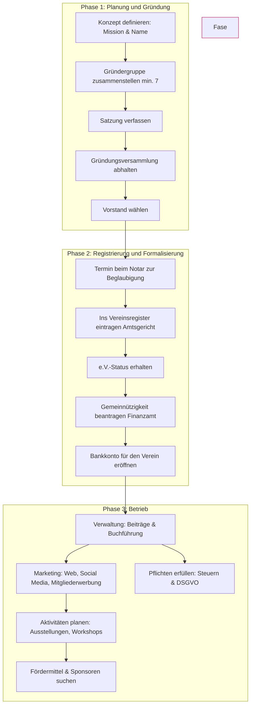

# Fahrplan zur Gründung eines Kunstvereins in Deutschland

## Phase 1: Planung und Gründung (1-3 Monate)

### 1.1. Konzeptdefinition
- **[ ] Mission und Vision:** Was ist der Zweck des Vereins? (z.B. Förderung lokaler Künstler, Organisation von Ausstellungen, Anbieten von Workshops usw.).
- **[ ] Name des Vereins:** Einen einzigartigen und repräsentativen Namen wählen. Verfügbarkeit prüfen.
- **[ ] Gründergruppe:** Mindestens 7 Personen zusammenbringen (gesetzliches Minimum für die Gründung eines e.V.).

### 1.2. Rechtliche Unterlagen
- **[ ] Satzung verfassen:**
    - Name und Sitz des Vereins.
    - Zweck - **Entscheidend für die Gemeinnützigkeit!**
    - Regeln für die Aufnahme und den Austritt von Mitgliedern.
    - Mitgliedsbeiträge.
    - Zusammensetzung des Vorstands.
    - Verfahren für die Mitgliederversammlung.
- **[ ] Gründungsprotokoll erstellen:**
    - Dokumentation der Gründungsversammlung, der Verabschiedung der Satzung und der Wahl des Vorstands.

### 1.3. Gründungsversammlung
- **[ ] Gründungsmitglieder einberufen.**
- **[ ] Satzung verlesen und verabschieden.**
- **[ ] Vorstand wählen:** Vorsitzender, stellvertretender Vorsitzender, Schatzmeister usw.
- **[ ] Protokoll und Satzung unterzeichnen.**

## Phase 2: Registrierung und Formalisierung (2-4 Monate)

### 2.1. Eintragung ins Vereinsregister
- **[ ] Termin beim Notar:**
    - Der Vorstand muss das Protokoll und die Satzung vorlegen.
    - Der Notar beglaubigt die Unterschriften und reicht den Antrag beim Amtsgericht ein.
- **[ ] Auf die Eintragung warten:** Nach der Eintragung wird der Verein zum "e.V." (eingetragener Verein).

### 2.2. Anerkennung der Gemeinnützigkeit
- **[ ] Satzung beim Finanzamt einreichen.**
- **[ ] "Freistellungsbescheid" beantragen:** Dieses Dokument bescheinigt, dass der Verein von der Körperschaftssteuer befreit ist und Spendenquittungen ausstellen darf.

### 2.3. Eröffnung eines Bankkontos
- **[ ] Ein Konto auf den Namen des Vereins (e.V.) eröffnen.**
- **[ ] Voraussetzung:** Vorlage des Vereinsregisterauszugs.

## Phase 3: Inbetriebnahme und Betrieb (Laufend)

### 3.1. Management und Verwaltung
- **[ ] System für Mitgliedsbeiträge einrichten.**
- **[ ] Buchführung:** Einnahmen und Ausgaben sorgfältig erfassen.
- **[ ] Jährliche Mitgliederversammlung (Jahreshauptversammlung) vorbereiten.**

### 3.2. Marketing und Kommunikation
- **[ ] Webseite und Social-Media-Profile erstellen.**
- **[ ] Logo und Marketingmaterialien entwerfen.**
- **[ ] Neue Mitglieder und Sponsoren gewinnen.**

### 3.3. Künstlerische Tätigkeiten
- **[ ] Veranstaltungskalender planen:** Ausstellungen, Workshops, Vorträge usw.
- **[ ] Einen Raum oder eine Location suchen (falls erforderlich).**
- **[ ] Öffentliche und private Fördermittel beantragen.**
- **[ ] Ein Netzwerk mit Künstlern, Galerien und Kultureinrichtungen aufbauen.**

### 3.4. Rechtliche und steuerliche Pflichten
- **[ ] Steuererklärung einreichen (auch wenn steuerbefreit).**
- **[ ] Vereinsregister auf dem neuesten Stand halten (z.B. bei Vorstandsänderungen).**
- **[ ] Datenschutzgrundverordnung (DSGVO/GDPR) einhalten.**